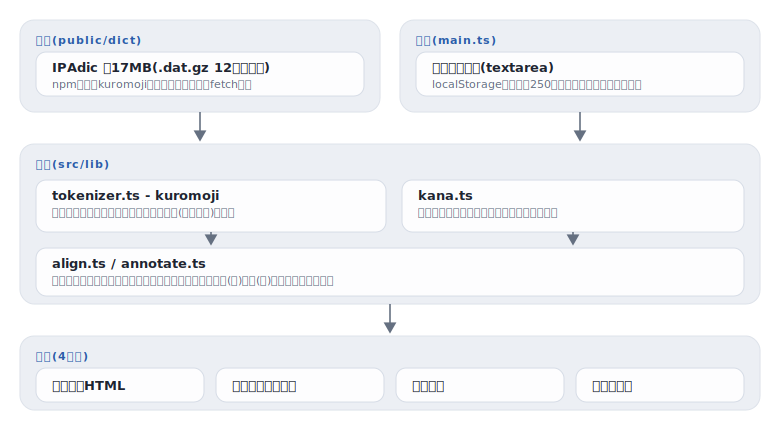

# furigana

[](https://github.com/miruky/furigana/actions/workflows/ci.yml)
[](https://github.com/miruky/furigana/actions/workflows/deploy.yml)
[](https://www.typescriptlang.org/)
[](LICENSE)

**漢字かな交じり文にふりがなを自動付与する。形態素解析を含む全処理がブラウザの中で完結し、文章を外部に送らない**

デモ: https://miruky.github.io/furigana/

## 概要

furiganaは、貼り付けた日本語の文章を形態素解析し、漢字に読みを振るWebアプリである。解析器はkuromoji.js、辞書はIPAdicで、初回アクセス時に約17MBの辞書をブラウザが読み込んだあとは、入力のたびにその場で解析する。サーバーへの送信は一切ない。

出力は5形式から選べる。ルビ表示はruby要素を使った組版で、リッチエディタにはルビごと、プレーンな入力欄には括弧書きとして貼り付けられる。括弧書きは「東京(とうきょう)」のようなテキストで、HTMLが使えないメールや原稿向け。かな文は漢字をすべて読みに開いた文、ローマ字は読みをヘボン式で語ごとに区切った文、分かち書きは形態素境界を空白で示した文を出す。結果はコピーのほか、ルビ表示は単体HTML・それ以外はテキストとして保存でき、表示はライト・ダーク・システムから選べる。

読みの割り当てには作り込みがある。形態素の読みは「読み込む=ヨミコム」のように語全体にしか付かないため、そのままでは送り仮名の上にもルビがかかる。furiganaは表層のかな部分を手がかりに読みを照合し、「読(よ)み込(こ)む」と漢字の連にだけルビを割り当てる。「聞き取り=ききとり」のように同じかなが繰り返されても正しく区切れる。

### なぜ作ったのか

ふりがな付与のWebサービスは文章をサーバーに送るものがほとんどで、未公開の原稿や業務文書には使いにくい。ブラウザ内で完結する形態素解析は辞書サイズの問題で敬遠されがちだが、辞書はキャッシュが効く静的ファイルなので、初回の17MBを許容すれば以後は完全にオフラインで動く。子ども向けの文書や日本語学習者向けの資料にルビを振る作業を、文章を外に出さずに済ませたかった。

## アーキテクチャ



## 技術スタック

| カテゴリ             | 技術                                |
| :------------------- | :---------------------------------- |
| 言語                 | TypeScript 5(strict)                |
| 形態素解析           | kuromoji.js + IPAdic                |
| ビルド               | Vite 7                              |
| テスト               | Vitest 4(実辞書での統合テスト込み)  |
| リンタ・フォーマッタ | ESLint(typescript-eslint)+ Prettier |
| CI / 配信            | GitHub Actions / GitHub Pages       |

## 使い方

### 解析からルビ付きHTMLまで

```ts
import { annotateTokens, loadTokenizer, readTokenLines, toRubyHtml } from './src/lib';

const tokenizer = await loadTokenizer('node_modules/kuromoji/dict');
const lines = readTokenLines(tokenizer, '新聞を読み込む。');
const html = toRubyHtml(annotateTokens(lines[0] ?? []));
// => '<ruby>新聞<rt>しんぶん</rt></ruby>を<ruby>読<rt>よ</rt></ruby>み<ruby>込<rt>こ</rt></ruby>む。'
```

### 読みの割り当てだけ使う

```ts
import { alignReading } from './src/lib';

alignReading('お疲れ様', 'おつかれさま');
// => [
//   { text: 'お' },
//   { text: '疲', ruby: 'つか' },
//   { text: 'れ' },
//   { text: '様', ruby: 'さま' },
// ]
```

`alignReading` は表層のかな部分を正規表現のリテラル、漢字の連をキャプチャに変換して読みと照合する。照合できない場合はトークン全体にルビを振る形へ安全に落ちる。

### 出力形式

```ts
import { annotateTokens, toBracketText, toHiraganaText, toRomajiText, toWakachi } from './src/lib';

const tokens = annotateTokens([
  { surface: '東京', reading: 'トウキョウ' },
  { surface: 'に', reading: 'ニ' },
  { surface: '住む', reading: 'スム' },
]);
toBracketText(tokens); // => '東京（とうきょう）に住（す）む'(括弧は全角)
toHiraganaText(tokens); // => 'とうきょうにすむ'
toRomajiText(tokens); // => 'toukyou ni sumu'(ヘボン式・語ごとに空白)
toWakachi(tokens); // => '東京 に 住む'
```

`hiraganaToRomaji` を直接呼べば、かな文字列をヘボン式へ変換できる。促音は次の子音を重ね(`がっこう` → `gakkou`)、`ち`系の前は `t` を置き(`まっちゃ` → `matcha`)、撥音は母音・や行の前で `n'` と切る(`しんよう` → `shin'you`)。

## プロジェクト構成

- `src/lib/kana.ts` カタカナとひらがなの変換、漢字判定
- `src/lib/romaji.ts` かなをヘボン式ローマ字へ写す
- `src/lib/align.ts` 読みを漢字の連へ割り当てるルビ整列
- `src/lib/annotate.ts` トークン列への注釈と5形式の出力
- `src/lib/tokenizer.ts` kuromojiの読み込みと行単位の解析
- `src/theme.ts` ライト・ダーク・システムのテーマ選好
- `src/main.ts` 入力・出力タブ・保存・コピー・テーマ切替のUI
- `scripts/copy-dict.mjs` npm依存の辞書をpublic/dictへ複製
- `docs/` アーキテクチャ図

## はじめ方

### 前提条件

- Node.js 22以上

### セットアップ

```bash
git clone https://github.com/miruky/furigana.git
cd furigana
npm ci
npm run dev
```

辞書は `npm ci` で取得され、dev・buildの前に `public/dict` へ自動で複製される(Git管理はしない)。

### テスト・lint・ビルド

```bash
npm test
npm run lint
npm run build
```

テストには実際のIPAdic辞書を読み込む統合テストを含む。初回は辞書の構築に数秒かかる。

### デプロイ

mainへのpushで `deploy.yml` がGitHub Pagesへ公開する。サブパス配信のためのbaseは環境変数 `FURIGANA_BASE` で渡す。

## 制約

- 読みはIPAdicの語彙に依存する。固有名詞・新語・専門用語は辞書にないことが多く、その場合ふりがなは付かない(誤った読みを推測で付けることはしない)。
- 「生れた」のような表外の送り仮名や、複数の読みを持つ語の文脈判定は形態素解析器の解釈に従う。人名・地名は特に誤読が出やすい。
- 初回アクセスで約17MBの辞書を読み込む。2回目以降はブラウザキャッシュから読むが、低速回線では初回に時間がかかる。
- ルビの読み照合に失敗した場合は、トークン全体にひとつのルビを振る形へ落とす。

## 設計方針

- **文章を外に出さない** — 形態素解析ごとブラウザに載せる。辞書の重さは初回だけの代価で、以後の解析は手元で完結する。
- **読みは漢字にだけ振る** — 語全体の読みを送り仮名ごと表示せず、かな部分との照合で漢字の連に割り当てる。整列ロジックは純関数で、繰り返しかな・カタカナ混じり・照合失敗時の安全な後退をテストで保証する。
- **わからないものに読みを付けない** — 辞書にない語は無理に推測せずそのまま通す。誤ったふりがなは無いより悪い。
- **辞書はリポジトリに置かない** — IPAdicはnpm依存(kuromoji同梱)から複製する。リポジトリは軽いまま、ビルドは再現可能に保つ。

## ライセンス

このリポジトリのコードは [MIT](LICENSE)。

同梱せず実行時に利用する辞書・解析器のライセンスは次のとおり。kuromoji.jsはApache License 2.0。IPAdicは奈良先端科学技術大学院大学由来の独自ライセンス(ICOT準拠)で、再配布時は元のライセンス文の保持が条件になる。配信物に含まれる辞書はkuromojiパッケージが同梱するものをそのまま使っている。
